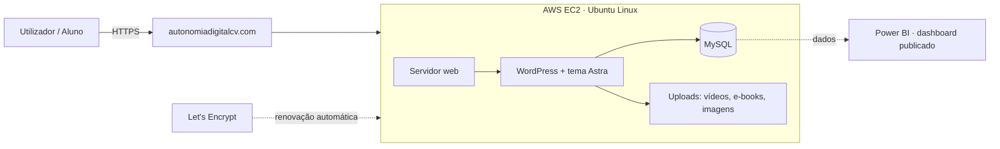

# Autonomia Digital CV — começar do zero, sem recursos, e mesmo assim ir para o ar

> **Projeto final · Skodji Digital**
> 🌐 **Ao vivo:** https://autonomiadigitalcv.com
> 👤 **Autor:** André Sanches · Formador de TIC e Engenheiro de TI · Mindelo, Cabo Verde
>
> ℹ️ *A formação recomenda o projeto em grupo; optei por **individual** e assumi todos os
> papéis — do problema à solução: conceção, desenvolvimento, servidor e deploy.*

---

## 1. O Problema (a dor)

Quis pôr o meu trabalho de formador **online** — dar cursos, partilhar materiais e vender
os meus e-books. Mas parti **do zero e sem recursos**, e bati de frente com três dores
reais:

1. **As plataformas prontas custam mais do que eu ganho.** Um serviço de cursos de marca
   branca (tipo EveClass) custa **~R$199–299/mês** (≈ 3.500–5.300 CVE) — **mais do que um
   curso inteiro por mês**. Para quem começa, é impossível.
2. **Sem um sítio próprio, o material perde-se.** A minha primeira turma recebia as aulas e
   os ficheiros pelo WhatsApp — e **perdia-os**. Numa aula, uma aluna não encontrava o
   ficheiro e ficou bloqueada: não era falha dela, era falta de um sítio **organizado e
   privado** da turma.
3. **Sem dados, decido às cegas.** Sem forma de ver o que funciona (que conteúdos, que
   vendas, que custos), qualquer decisão sobre onde investir o pouco tempo e dinheiro é um
   palpite.

**E não sou só eu.** Este é o dia a dia de muitos **formadores e pequenos negócios em Cabo
Verde**: querem presença digital, mas não têm orçamento para SaaS caros nem equipa técnica.

> **Tinha de procurar uma solução — não podia esperar por dinheiro que não existia.**
> Foi essa a pergunta deste projeto: *como é que quem começa do zero, sem recursos, põe um
> serviço digital sério no ar e mantém a autonomia?*

---

## 2. A Solução

Um **web service e um site próprios**, montados por mim numa nuvem a **baixo custo**, que me
dão autonomia total — sem plataformas caras no meio:

- Um **servidor** meu (AWS EC2 · Ubuntu) que administro e mantenho.
- Um **site** (WordPress) com blog, loja de e-books, **cursos** e uma **área de turma
  privada** onde as aulas e os materiais **nunca mais se perdem**.
- Um **dashboard em Power BI** com os dados do site, **publicado**, para eu **ver o que
  funciona e decidir** — em vez de adivinhar.

**Custo total: ~5 USD/mês.** É a diferença entre depender de uma plataforma cara e ter o meu
próprio serviço no ar. É, no fundo, a tese da marca: **autonomia digital, sem complicações.**

---

## 3. Como a solução ataca cada dor

| A dor | O que resolve | Como |
|---|---|---|
| Plataformas caras | **Servidor + site próprios** | AWS EC2 a ~5 USD/mês em vez de ~R$199–299/mês |
| Material que se perde | **Área de turma `/turma1`** | sítio único e privado (palavra-passe) com vídeos, ficheiros e resolvidos |
| Decidir às cegas | **Dashboard em Power BI** | indicadores do site publicados, para decidir com dados |

---

## 4. O que o site faz

- **Institucional** da marca (Início, Sobre, Contacto).
- **Blog** com artigos técnicos, cada um com imagem de destaque própria.
- **Loja de e-books** — coleção "… do Zero" (AWS, Excel, Word) + página de venda.
- **Cursos** (`/cursos`, `/excel-do-zero`) e **área de turma protegida** (`/turma1`) com
  aulas em vídeo, ficheiros e materiais.
- **SEO controlado**: páginas privadas ficam automaticamente fora do Google (*mu-plugin* próprio).

---

## 5. Arquitetura



| Camada | Tecnologia | Porquê |
|---|---|---|
| Alojamento | **AWS EC2** (Ubuntu, instância pequena) | controlo total e cloud a baixo custo |
| Web / CMS | **WordPress + tema Astra** | publicar conteúdo depressa, extensível com código próprio |
| Segurança | **HTTPS (Let's Encrypt)**, renovação automática | tráfego cifrado, sem custo |
| BI | **Power BI** (relatório publicado) | transformar os dados do site em decisão |
| Custo | **~5 USD/mês** | um serviço real a operar com orçamento mínimo |

---

## 6. Como a formação se aplicou (mapa por módulo)

Os módulos que mais me envolveram (⭐) são o **núcleo técnico** deste projeto.

| Módulo | O que aprendi | Como o apliquei |
|---|---|---|
| Inglês aplicado aos negócios tecnológicos | ler documentação técnica e comunicar em inglês | docs de AWS/WordPress, este README, mensagens de *commit* |
| Essenciais de Trabalho e Comunicação | organização e comunicação profissional | escrita das páginas e artigos; comunicação com alunos; gestão de tarefas |
| **Linux e Segurança na Cloud** ⭐ | administrar Linux e proteger serviços na nuvem | **EC2 (Ubuntu) por SSH; HTTPS com Let's Encrypt; permissões, *swap*, manutenção** |
| Empreendedorismo, Criatividade e Packs de Serviço | transformar competências em produtos | a marca **Autonomia Digital**; e-books e cursos como *packs*; página de venda |
| Kit de Ferramentas p/ Trabalho Remoto e Freelance · *Tech Checkpoint* | ferramentas de trabalho remoto | Git/GitHub, cópias de segurança em vários locais, perfil de *freelancer* |
| **BI & Cloud Default** ⭐ | **Power BI**: criar e **publicar** relatórios/*dashboards* | **dashboard com os dados do site, publicado** — ver secção 9 |
| Engenharia de Inteligência Artificial | fundamentos de IA aplicada | evolução prevista (secção 11) |
| Engenharia de Software e Python para Dados | programar e automatizar com Python | **automação em Python** para gerar conteúdos/materiais; boas práticas de repositório |
| Projeto · *Demo Day* | conceber, documentar e apresentar | este projeto, este repositório e a apresentação |

---

## 7. Estrutura do repositório

```
.
├── README.md                 # este documento
├── docs/
│   ├── arquitetura.md        # diagrama e decisões
│   └── capturas/             # screenshots (antes/depois, dashboard)
├── css/
│   └── additional-css.css    # CSS personalizado do tema
├── mu-plugins/
│   └── noindex.php           # mantém páginas privadas fora do Google
├── deploy/
│   └── deploy.sh             # script de publicação (SEM credenciais)
├── powerbi/
│   └── dashboard.pbix        # relatório do Power BI (sem dados sensíveis)
└── .gitignore                # protege segredos de irem para o repo
```

---

## 8. Como correr / reproduzir

1. Provisionar uma instância Linux (AWS EC2, Ubuntu).
2. Instalar servidor web, PHP e base de dados.
3. Instalar o WordPress e o tema Astra.
4. Aplicar o CSS (`css/`) e os *mu-plugins* (`mu-plugins/`).
5. Configurar domínio e HTTPS (Let's Encrypt).
6. Publicar conteúdos e ligar o **Power BI** aos dados do site.

> 🔐 **Sem segredos no repositório.** Não há chaves, palavras-passe, IPs, certificados nem
> dados de alunos — vivem num gestor de senhas, fora do controlo de versões, e estão
> bloqueados pelo `.gitignore`.

---

## 9. Dashboard em Power BI (ver o que funciona)

Para fechar o ciclo *o site gera dados → os dados viram decisão*, construí um **dashboard em
Power BI** com indicadores do site e **publiquei-o** (link partilhável), tal como no módulo
de BI.

- **Dados:** publicações do site (artigos e páginas) por **tipo**, **categoria** e **data**,
  exportadas para [`powerbi/dados_site.csv`](powerbi/dados_site.csv). (Opcional: e-books e
  custo AWS acrescentados à mão.)
- **Ligação Power BI ↔ site (escolhida): CSV exportado do WordPress** (via `wp-cli`) e
  carregado no Power BI. É a via mais **simples e segura** — não expõe a base de dados — e é
  a que melhor demonstra *"criar e publicar um relatório"*. A base de dados **nunca** é
  aberta à internet.
- **Visuais sugeridos:** publicações **por mês**, publicações **por categoria**, cartões com
  o total de **artigos/páginas/e-books**, e um cartão com o **custo mensal (~5 USD)**.
- **Publicação:** *Publicar na Web* (link público). ⚠️ Só métricas — **nada de dados pessoais**.

🔗 **Dashboard:** ✏️ *(colocar aqui o link depois de publicares no Power BI)*

---

## 10. Resultados / Impacto

> ✏️ Confirmar/atualizar antes de apresentar.

- Serviço **em produção** desde **julho de 2026**, com **HTTPS** e renovação automática.
- **~5 USD/mês** — contra ~R$199–299/mês de uma plataforma SaaS equivalente.
- **8 artigos**, **9 páginas** e **3 e-books** publicados (dados reais do site, set. 2026).
- Uma **turma real** a usar a `/turma1` — materiais e gravações num só sítio, **deixaram de
  se perder**.
- Decisões apoiadas em **dados** (dashboard em Power BI), não em palpites.

---

## 11. O que aprendi + próximos passos

**Aprendi:** ✏️ 3–4 frases honestas — o mais difícil, o que resolvi sozinho, o que levo da
formação (começar do zero e mesmo assim entregar algo no ar).

**A seguir:** ✏️ ex.: uma funcionalidade de **IA** (assistente de dúvidas dos alunos);
automatizar cópias de segurança; mais cursos na plataforma.

---

*Autonomia Digital CV · "Tecnologia & Educação, sem complicações." · Mindelo, Cabo Verde ·
Projeto final Skodji Digital.*
