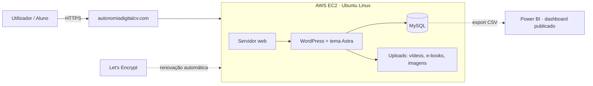

# Arquitetura & decisões

## Visão geral

## Decisões e porquê

| Camada | Escolha | Porquê |
|---|---|---|
| Alojamento | AWS EC2 (Ubuntu, instância pequena) | controlo total do servidor e cloud a baixo custo (grátis nos primeiros 6 meses) |
| Web / CMS | WordPress + tema Astra | publicar conteúdo depressa; extensível com CSS e *mu-plugins* próprios |
| Segurança | HTTPS com Let's Encrypt, renovação automática | tráfego cifrado, sem custo adicional |
| Privacidade | *mu-plugin* `noindex` nas páginas com palavra-passe | as áreas de turma ficam fora do Google |
| BI | Power BI, dados via **CSV exportado** (`wp-cli`) | demonstra criar e publicar relatórios **sem expor a base de dados** |

## Segurança

- A base de dados MySQL **não** está aberta à internet.
- Se um dia o Power BI ligar diretamente ao MySQL, será **apenas por túnel SSH**.
- Chaves, palavras-passe, certificados e dados de alunos **nunca** entram no repositório
  (ver `.gitignore`); vivem num gestor de senhas, fora do controlo de versões.

## Custo

**Camada gratuita da AWS** até dez/2026 (6 meses); a partir daí, estimativa própria de
**~1.000–1.400 CVE/mês** (≈ 10–13 USD: instância + disco + IP público). Mesmo depois, é uma
fração de uma plataforma SaaS equivalente (~3.500–5.300 CVE/mês) — a diferença entre depender
de terceiros e ter autonomia.

> Valores a **confirmar** na consola AWS (Billing and Cost Management → *Bills* e *Free Tier*);
> a estimativa vem da tabela pública de preços, não de uma fatura.
